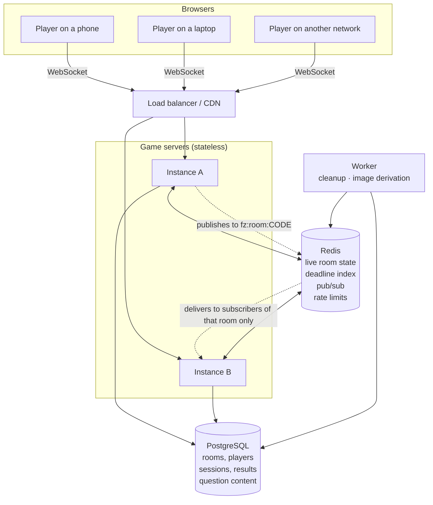
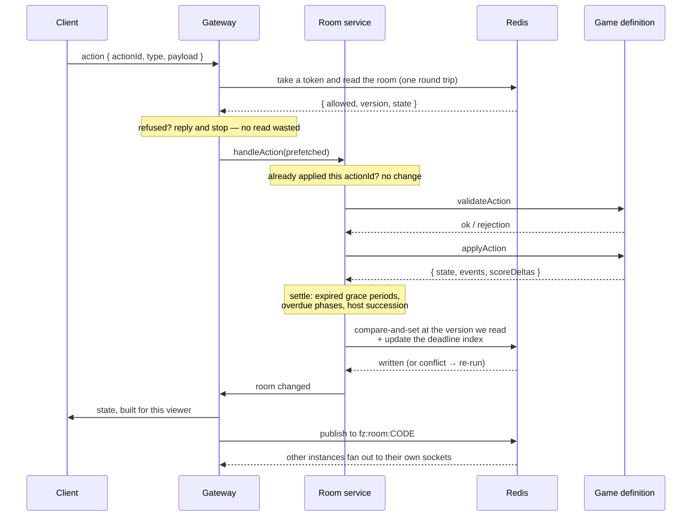
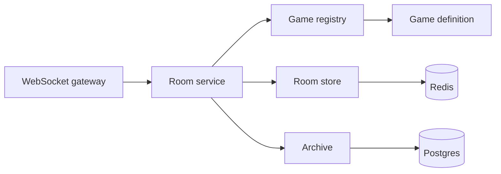

# Architecture

## The shape of it

A modular monolith: one server process that speaks HTTP and WebSocket, backed
by Redis for live state and Postgres for durable records, with a separate
worker for background jobs. Several copies of that process run behind a load
balancer and coordinate through Redis.

Instances hold no authoritative state. A player on instance A and a player on
instance B are in the same room because the room lives in Redis, not in either
process. Any instance can serve any player, and losing one costs its sockets a
reconnect and nothing else.

## Request paths

Two, deliberately separated.

**HTTP** creates and joins rooms. It is rate limited per address, returns
status codes a browser understands, and hands back a signed session token. A
join that fails — a full room, a taken name, a game already running — is an
ordinary HTTP error the join screen can explain.

**WebSocket** carries everything after that. The token arrives in the first
frame rather than the query string, so it stays out of access logs and browser
history. From then on the socket carries actions up and state down.

## Applying an action

This is the hot path, and everything about the design follows from keeping it
short.

Two Redis round trips, both required. Nothing else on this path awaits
anything: the archive write and the cross-instance publish are fire-and-forget,
and the per-viewer payloads are built synchronously.

## Who owns what

| Concern | Owner | Why there |
| --- | --- | --- |
| Live room state | Redis | Changes many times a second, must be shared, must not outlive the party |
| Round deadlines | Redis sorted set | Any instance can notice any room is due; survives a restart |
| Cross-instance updates | Redis pub/sub, per room | Only instances holding a socket for that room pay for its traffic |
| Rate limits | Redis token buckets | Per-process limits multiply by the instance count |
| Rooms, players, results | Postgres | Worth keeping after the room is gone |
| Question content | Postgres, cached in process | Static between deploys; never read during a round |
| Game rules | `packages/game-engine` | Pure functions, no I/O, testable without a server |
| Screens | `apps/web` | One component per game, chosen by id, no other branching |

## Layers

The gateway knows about sockets and nothing about games. The room service knows
about rooms, presence, scores and scheduling, and nothing about any specific
game — it resolves a definition by id and calls the interface. The definitions
know their own rules and nothing about transport, storage or other players'
connections.

That boundary is the main architectural claim of the project, and it is
checkable: there is no `if (gameId === ...)` anywhere in `apps/server`.

## Why a monolith

Nothing here wants to be a separate service. The room service, the gateway and
the scheduler share a process because they share the same state and the same
tick; splitting them would add a network hop to a path measured in
milliseconds, and a second failure mode to every transition. The worker is
separate because CPU-bound image work genuinely should not share an event loop
with ten thousand sockets — that is a real reason, and it is the only one that
applied.

See [`adr/001-modular-monolith.md`](adr/001-modular-monolith.md).
