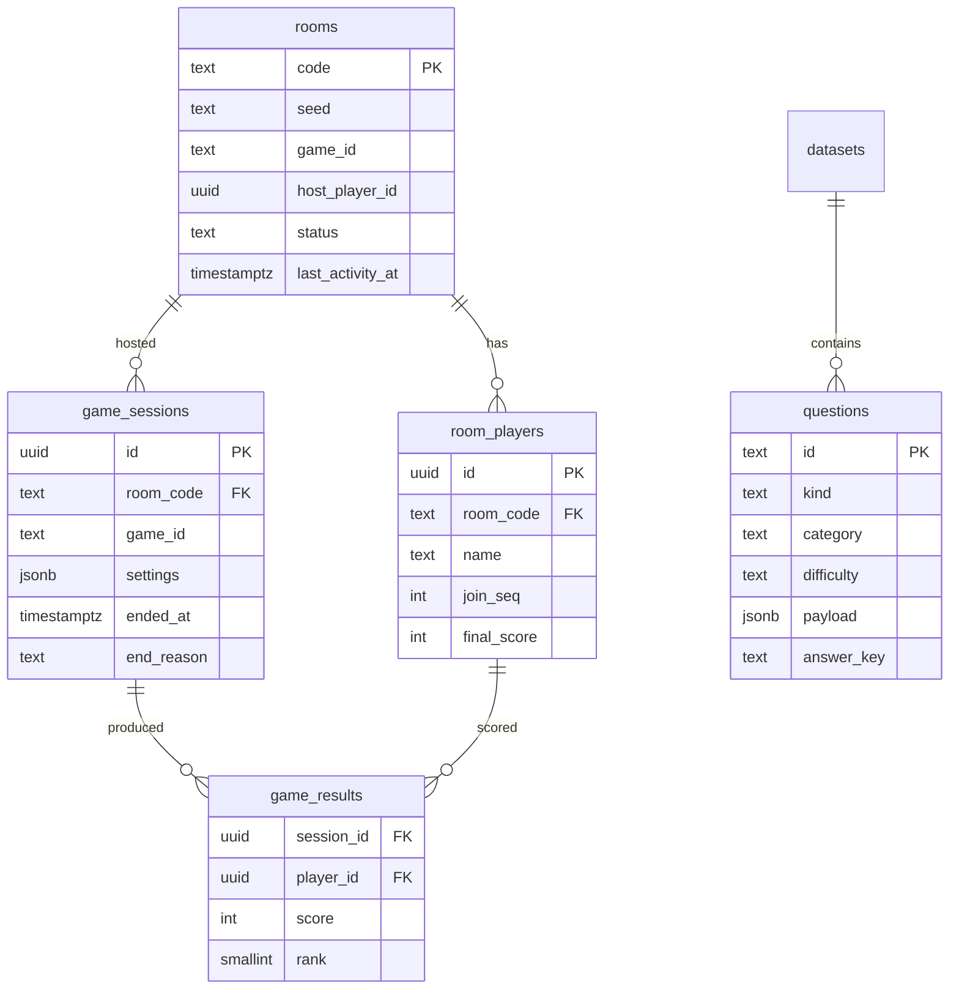

# PostgreSQL

## What belongs here

The rule: Postgres holds what is worth keeping after the room is gone.

| | Where | Why |
| --- | --- | --- |
| **Durable** — rooms, players, sessions, results, lifecycle events, question content | Postgres | Outlives the party. Someone may ask what happened. |
| **Ephemeral** — live room state, presence, current round, answers in flight | Redis | Changes many times a second. Meaningless an hour later. |
| **Cached** — question pools | Redis TTL + in-process | Static between deploys, read on every game start |
| **Derived** — scoreboard, ranks, public views | Computed per request | Storing it would mean keeping two things in step |

## Schema



Notes on choices that were not obvious:

**`rooms.seed` is stored.** It is the input to every draw a game makes, so
keeping it means a finished session's question order can be reproduced exactly
— which is the difference between investigating a scoring complaint and
guessing.

**`room_players(room_code, join_seq)` is unique.** Host succession is defined
in terms of join order, so it has to be unique and stable per room.

**`questions.payload` is the engine's own `ContentItem`, stored whole.** Only
the columns used for selection are lifted out. The database does not
need to know what a "blur stage" is, and a game gaining a field does not need a
migration.

**Selection happens in memory, not in SQL.** The server loads a whole kind once
and caches it for five minutes, then filters difficulty and category in process,
so starting a game is usually zero queries and survives a brief Postgres outage.
`questions_pick_idx` leads on `kind` accordingly. At the current scale Postgres
correctly chooses a sequential scan over 291 rows; the index earns its keep as
the library grows.

**`questions(kind, answer_key)` is unique.** `answer_key` is the normalised
answer, so two items a player could not tell apart cannot both be in the pool.
This is enforced at seed time and fails loudly.

**There is no `answers` table.** Persisting every submission would turn a party
game into a write-heavy pipeline for data nobody reads. Answers live in the
session state and are summarised into `game_results` when the game ends.

## Writes are off the hot path

Nothing in a round awaits Postgres. The archive is called without `await` at
lifecycle boundaries only — room created, game started, game finished — and a
failure is logged rather than propagated:

```ts
void this.archive.recordGameFinished(room, sessionId)
  .catch((err) => this.logger.error({ err, roomCode }, 'failed to archive game result'))
```

If Postgres is down, players keep playing and history is lost for the duration.
That is the right trade for this product: the game is not recoverable, the
history is.

## Pool settings, and why

```ts
connectionTimeoutMillis: 5_000   // fail fast instead of queueing behind a sick database
idleTimeoutMillis: 30_000
statement_timeout: 10_000        // no query may ever be the thing a realtime handler waits on
max: PG_POOL_MAX                 // default 10 per instance
```

The pool's `error` handler logs and continues. An idle client dropping must not
take down a process holding thousands of sockets.

## Migrations

A small runner in `apps/server/src/db/migrate.ts`: files applied in filename
order, each inside its own transaction together with the row recording it, so a
crash leaves a migration either wholly applied and recorded or neither. A
Postgres advisory lock serialises concurrent boots — when three instances start
at once, one migrates and the others wait and then find nothing to do.
