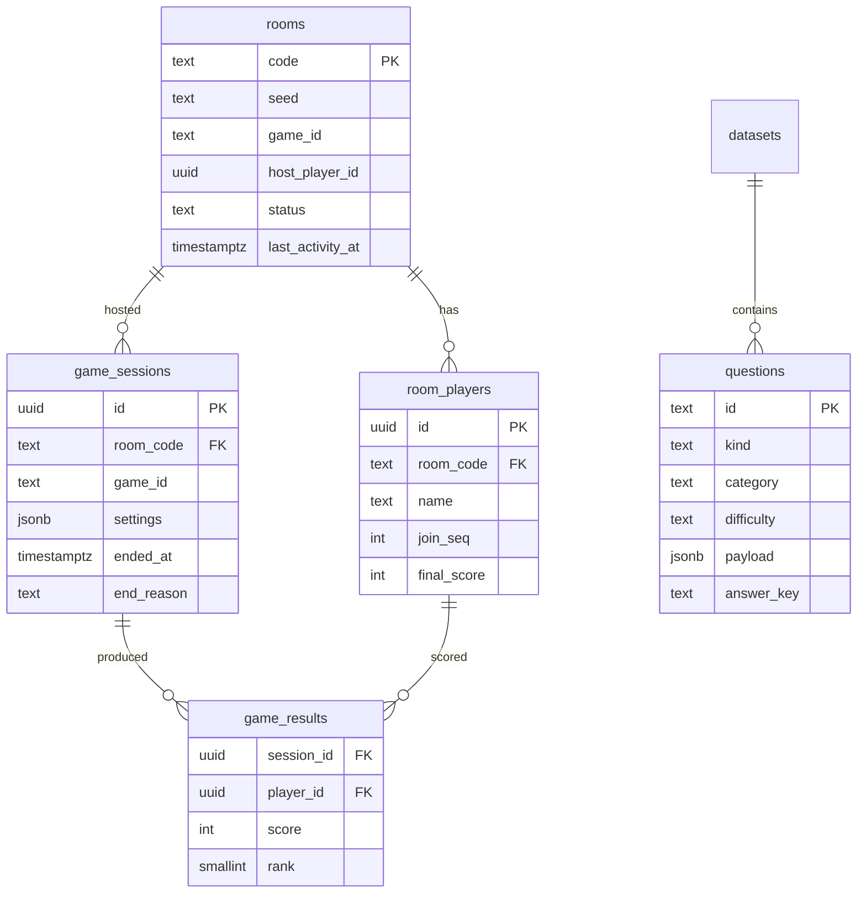

# PostgreSQL

## What belongs here

The rule: Postgres holds what is worth keeping after the room is gone.

| | Where | Why |
| --- | --- | --- |
| **Durable** — rooms, players, sessions, results, lifecycle events, question content | Postgres | Outlives the party. Someone may ask what happened. |
| **Ephemeral** — live room state, presence, current round, answers in flight | Redis | Changes many times a second. Meaningless an hour later. |
| **Cached** — question pools | Redis TTL + in-process | Static between deploys, read on every game start |
| **Derived** — scoreboard, ranks, public views | Computed per request | Storing it would mean keeping two things in step |

## Schema



Notes on choices that were not obvious:

**`rooms.seed` is stored.** It is the input to every draw a game makes, so
keeping it means a finished session's question order can be reproduced exactly
— which is the difference between investigating a scoring complaint and
guessing.

**`room_players(room_code, join_seq)` is unique.** Host succession is defined
in terms of join order, so it has to be unique and stable per room.

**`questions.payload` is the engine's own `ContentItem`, stored whole.** Only
the columns used for selection are lifted out. The database does not
need to know what a "blur stage" is, and a game gaining a field does not need a
migration.

**Selection happens in memory, not in SQL.** The server loads a whole kind once
and caches it for five minutes, then filters language, category and difficulty
in process, so starting a game is usually zero queries and survives a brief
Postgres outage. `questions_pick_idx` leads on `kind` accordingly. At the
current scale Postgres correctly chooses a sequential scan over ~900 rows; the
index earns its keep as the library grows.

There is deliberately no `ORDER BY random()`. Which item a room gets depends on
the room's seed and the room's recent history, both of which live in state the
database does not hold — see [the game engine](game-engine.md#choosing-content).

**`questions(kind, answer_key)` is unique.** `answer_key` is the normalised
answer, so two items a player could not tell apart cannot both be in the pool.
This is enforced at seed time and fails loudly.

**Language lives in the payload, not a column.** `questions.payload` is the
`ContentItem`, and a movie's `language` is one of its fields. Filtering happens
in memory over a cached pool, so lifting it into a column would buy an index
nothing queries. `category` is a column only because the pipeline and the admin
page group by it.

**There is no `answers` table.** Persisting every submission would turn a party
game into a write-heavy pipeline for data nobody reads. Answers live in the
session state and are summarised into `game_results` when the game ends.

## The content library

What the datasets contain and the rules they were written to is
[content.md](content.md); this is how they reach Postgres.

```
data/seed/
  movies/telugu.json      135   Emoji Movie: one file per language
  movies/hindi.json        72
  movies/english.json      60
  movies/tamil.json        48
  movies/malayalam.json    36
  mafia.json               90   Movie Mafia subjects, with fan and imposter clues
  prompts.json            221   Mind Meld, across 17 themes
  identities.json         177   Who Am I?, across 7 categories
  image-subjects.json      79   Blur Battle; the pipeline derives the blur ladder
```

918 items across the files. Blur Battle is the one kind seeded from the
pipeline's output rather than from its subject list, so how many of its 79
subjects arrive depends on the pipeline: the placeholder build keeps all of
them, while the Wikimedia fetch in this repo's development database rejected
`im-macaron` and loaded 78.

One file per language keeps the diff to twenty lines when someone adds twenty
Tamil films, and makes an item's language a property of where it lives rather
than a field somebody can forget to set.

Seeding is idempotent and scoped to a dataset: rows in the file are upserted,
and rows that are in the dataset's table but no longer in its file are deleted
**before** the inserts run. The ordering is not incidental. `questions(kind,
answer_key)` is unique and does not filter on `active`, so retiring a row by
flagging it inactive does not release its answer key — a renamed item would
collide with its own former self. Nothing outside the dataset being loaded is
touched, so a deploy can never empty the library.

The seed also refuses answers a player could not tell apart. Identical
normalised answers would violate the unique index anyway; near-identical ones
would not, and the games forgive typos, so two titles one edit apart mean one
is silently accepted for the other. `Gamyam` and `Gaayam` are both real Telugu
films and one edit apart, which is how this check came to exist.

## Writes are off the hot path

Nothing in a round awaits Postgres. The archive is called without `await` at
lifecycle boundaries only — room created, game started, game finished — and a
failure is logged rather than propagated:

```ts
void this.archive.recordGameFinished(room, sessionId)
  .catch((err) => this.logger.error({ err, roomCode }, 'failed to archive game result'))
```

If Postgres is down, players keep playing and history is lost for the duration.
That is the right trade for this product: the game is not recoverable, the
history is.

## Pool settings, and why

```ts
connectionTimeoutMillis: 5_000   // fail fast instead of queueing behind a sick database
idleTimeoutMillis: 30_000
statement_timeout: 10_000        // no query may ever be the thing a realtime handler waits on
max: PG_POOL_MAX                 // default 10 per instance
```

The pool's `error` handler logs and continues. An idle client dropping must not
take down a process holding thousands of sockets.

## Migrations

A small runner in `apps/server/src/db/migrate.ts`: files applied in filename
order, each inside its own transaction together with the row recording it, so a
crash leaves a migration either wholly applied and recorded or neither. A
Postgres advisory lock serialises concurrent boots — when three instances start
at once, one migrates and the others wait and then find nothing to do.
