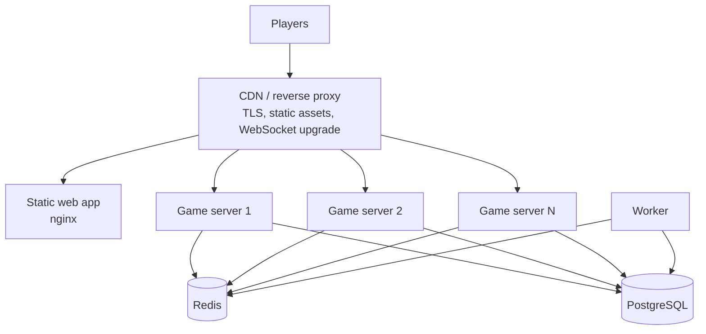

# Deployment

## Shape



No Kubernetes, no service mesh, no message broker. Game servers are stateless,
so scaling is "run more of them" and the load balancer needs no stickiness —
a player reconnecting to a different instance resumes the same round.

## One box

```bash
export SESSION_SECRET=$(node -e "console.log(require('crypto').randomBytes(32).toString('base64url'))")
export POSTGRES_PASSWORD=$(openssl rand -base64 24)
export PUBLIC_ORIGIN=https://friendzone.example

docker compose -f docker-compose.prod.yml up -d --build
docker compose -f docker-compose.prod.yml exec server node -e "1"   # migrations ran at boot
docker compose -f docker-compose.prod.yml run --rm worker node dist/worker.js &
```

Scale the game servers: `--scale server=3`. Put a proxy in front for TLS that
forwards WebSocket upgrades and sets `X-Forwarded-For`.

## Images

One Dockerfile, three targets:

| Target | Contents |
| --- | --- |
| `server` | Bundled API, migrations included, health check, runs as `node` |
| `worker` | Same bundle plus `sharp`, no health check |
| `web` | Static build behind nginx with SPA fallback |

The server is bundled to a single file with esbuild. The workspace packages
export TypeScript source — which is what lets dev, tests and the editor resolve
the same files with no build step — and bundling at deploy time keeps that
without asking Node to resolve TypeScript at runtime.

## Configuration

Everything is parsed once at boot and the process refuses to start if it is
wrong, with a message naming the variable. Nothing downstream reads
`process.env`.

| Variable | Required | |
| --- | --- | --- |
| `SESSION_SECRET` | **yes** | 32+ random bytes. Production refuses to start with the example value. |
| `DATABASE_URL` | **yes** | |
| `REDIS_URL` | **yes** | |
| `CORS_ORIGINS` | **yes in production** | Comma-separated. Empty is refused. |
| `PUBLIC_WEB_ORIGIN` | yes | Used to build shareable room links |
| `ADMIN_TOKEN` | no | **Admin routes are not registered without it** |
| `PLAYER_GRACE_SECONDS` | no | Default 45 |
| `ROOM_LOBBY_TTL_SECONDS` | no | Default 1800 |
| `SCHEDULER_TICK_MS` | no | Default 250 |
| `RL_*` | no | `capacity:refillPerSecond` |

## Behind a proxy

`trustProxy` is enabled in production, so `request.ip` is read from
`X-Forwarded-For`. That matters: it is the subject of the room-creation and
join rate limits. A proxy that does not set it correctly turns those into a
global limit shared by everyone.

The proxy must forward `Upgrade` and `Connection` headers, and its idle timeout
must exceed the 15-second heartbeat — 60 seconds or more.

## Health

| Endpoint | Purpose |
| --- | --- |
| `/health` | **Liveness.** Touches nothing external. A liveness probe that checked the database would restart every healthy instance during a database blip. |
| `/ready` | **Readiness.** Checks Redis and Postgres, reports content counts, and fails with `draining` during shutdown so the load balancer stops sending new players first. |
| `/metrics` | Prometheus. Not authenticated; put it behind your network policy. |

## Rolling deploys

Shutdown is ordered so a deploy costs players a reconnect and nothing else:

1. Readiness fails — the balancer stops sending new players while everything
   still works.
2. The scheduler stops; its rooms are in Redis and another instance claims them
   within a tick.
3. Every socket receives a `bye` and closes. Clients treat it as "come straight
   back" and reconnect elsewhere inside their grace period, so nobody is marked
   inactive and no round is lost.
4. HTTP stops accepting; in-flight requests finish.
5. Redis, then Postgres, close.

`stop_grace_period` is 30 seconds for the server and 60 for the worker, which
may be mid-derivation. A drain that hangs is force-exited after 15 seconds
rather than wedging.

Migrations run at boot behind a Postgres advisory lock, so several instances
starting together is safe — one migrates, the others wait and find nothing to
do. Keep migrations backward compatible for one release, since old and new
instances overlap during a rollout.

## Content

The Blur Battle images are generated, not committed — 48 MB of derived files.
Build them as part of your release and ship them with the web image:

```bash
npm run dataset:fetch     # or dataset:sample for placeholders
npm run seed
```

`/ready` reports per-kind content counts, which is the quickest way to see that
a deployment has content at all.

## Operating notes

- **Alert on** `friendzone_scheduler_errors_total` above zero (rounds are not
  advancing — the worst failure here), WebSocket connection failure rate,
  `friendzone_cas_retries_total` rising in steady state, and Redis reachability.
- **Redis is the hard dependency.** Postgres being down costs history, not
  gameplay. Redis being down stops play, safely — see
  [redis.md](redis.md).
- **Back up Postgres.** Redis holds nothing worth backing up: everything in it
  is either transient or reconstructible.
- **Run one worker.** Its jobs are idempotent, but a second adds nothing.
