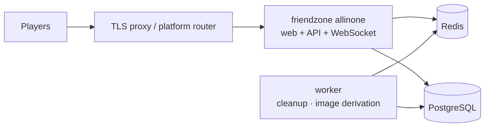
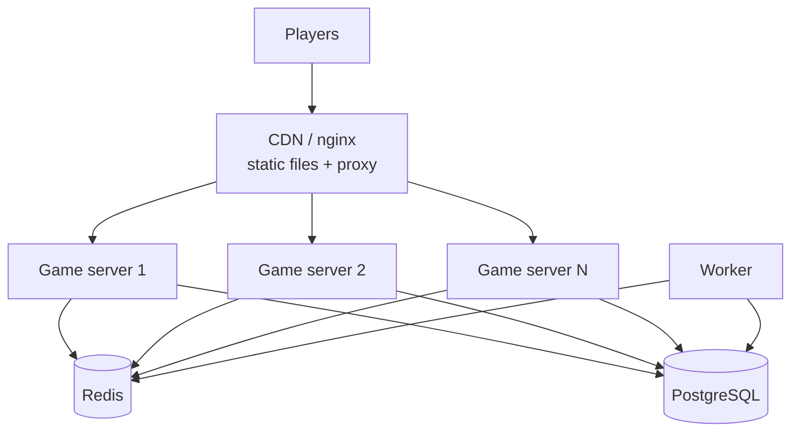

# Deployment

## Two shapes

**One container.** The server serves the web app, the API and the WebSocket on
a single origin. No reverse proxy to configure, no CORS, and a same-origin
socket by construction. This is the right shape for anything up to a few
thousand concurrent players, and it is where to start.



**Split, for scale.** The web app becomes static files behind nginx, which
proxies `/api` and `/ws` to a pool of game servers — so the browser still
sees one origin. Game servers hold no state, so scaling is "run more of them"
and the load balancer needs no stickiness: a player reconnecting to a different
instance resumes the same round.



No Kubernetes, no service mesh, no message broker.

## Render, on the free plan

A `render.yaml` blueprint creates the app, a Postgres and a Key Value
instance in one go:

  render.com -> New -> Blueprint -> connect this repo

Nothing else to configure. Render generates `SESSION_SECRET`, wires
`DATABASE_URL` and `REDIS_URL`, and the app migrates and seeds itself on
first boot.

What the free plan costs you, stated plainly because all three affect a party
game:

| | |
| --- | --- |
| **Cold starts** | The service suspends after 15 minutes idle and takes about a minute to wake. The first person to open your link waits that out. Open it yourself before you share it. |
| **Key Value is in-memory and may restart at any time** | Live room state lives there. A restart ends games in progress — players are told the room is gone rather than seeing anything corrupt, but the game is over. |
| **Postgres expires 30 days after creation** | Only history lives there, so losing it costs finished-game records, not gameplay. Recreate it or move to a paid plan. |

None of these corrupt anything: every state change is one atomic
compare-and-set, so the failure mode is a room that vanishes, not a room that
lies. But a long session on a free instance will be interrupted eventually.

Paid plans remove all three. The same blueprint works — change the `plan`
values.

## One box, one command

```bash
export SESSION_SECRET=$(node -e "console.log(require('crypto').randomBytes(32).toString('base64url'))")
export POSTGRES_PASSWORD=$(openssl rand -base64 24)
export PUBLIC_ORIGIN=https://friendzone.example      # or http://localhost:8080 to try it

docker compose -f docker-compose.prod.yml up -d --build
```

That is the whole deployment. The app container migrates the database at boot
and, because `SEED_ON_BOOT` is set in that image, brings the content library in
line with the data files it carries. Verified from a wiped database: it comes
up playable with no second command.

For real photographs in Blur Battle rather than generated placeholders, pass a
contact address at build time, as Wikimedia asks of automated clients:

```bash
export WIKIMEDIA_USER_AGENT="FriendZone/1.0 (you@example.com)"
docker compose -f docker-compose.prod.yml up -d --build
```

It adds a few minutes to the build while it fetches and derives 78 images.

## Images

One Dockerfile, five targets:

| Target | Contents |
| --- | --- |
| `allinone` | Server plus the built web app on one origin. Seeds at boot. |
| `server` | API and WebSocket only, for the split shape |
| `worker` | Same bundle plus `sharp`, no health check |
| `web` | Static app behind nginx, proxying `/api` and `/ws` to `server:8080` |
| `deps` / `build` | Intermediate |

The server is bundled to a single file with esbuild. The workspace packages
export TypeScript source — which is what lets dev, tests and the editor resolve
the same files with no build step — and bundling at deploy time keeps that
without asking Node to resolve TypeScript at runtime. The bundle carries its
own migrations and seed data.

## Configuration

Everything is parsed once at boot and the process refuses to start if it is
wrong, with a message naming the variable. Nothing downstream reads
`process.env`.

| Variable | Required | |
| --- | --- | --- |
| `SESSION_SECRET` | **yes** | 32+ random bytes. Production refuses to start with the example value. |
| `DATABASE_URL` | **yes** | |
| `REDIS_URL` | **yes** | |
| `CORS_ORIGINS` | **yes in production** | Comma-separated. Empty is refused. |
| `PUBLIC_WEB_ORIGIN` | yes | Used to build shareable room links |
| `ADMIN_TOKEN` | no | **Admin routes are not registered without it** |
| `WEB_DIST` | no | Serve the built web app from this process. Set in the `allinone` image. |
| `SEED_ON_BOOT` | no | Reconcile the content library with this image's data files at boot. Set in the `allinone` image. |
| `DATA_DIR` | no | Where the seed JSON lives; inferred when unset |
| `PLAYER_GRACE_SECONDS` | no | Default 45 |
| `ROOM_LOBBY_TTL_SECONDS` | no | Default 1800 |
| `SCHEDULER_TICK_MS` | no | Default 250 |
| `RL_*` | no | `capacity:refillPerSecond` |

## Content

With the `allinone` or `web` image there is nothing to do: the images are
generated during the build and shipped inside it. Building without a
`WIKIMEDIA_USER_AGENT` produces placeholder art, which plays identically and
needs no network.

Outside Docker, build it yourself before starting:

```bash
npm run dataset:fetch     # or dataset:sample for placeholders
npm run seed
```

`/ready` reports per-kind content counts, which is the quickest way to see
whether a deployment has content at all. A healthy deployment built from
this repo reports `emoji 351, identity 177, image 79, mafia 90, prompt 221`.

### Updating content on a live deployment

`npm run seed` against a production database is safe to run repeatedly, and
safe to run while people are playing:

- it is **idempotent** — the same files produce the same rows;
- it is **scoped to a dataset** — a file only ever adds, updates or removes
  rows carrying its own `dataset_id`, so loading the Telugu films cannot touch
  Mind Meld's prompts, and a partial data directory cannot empty the library;
- an item dropped from a file is **deleted before** the inserts run, which is
  what frees its `(kind, answer_key)` for a renamed replacement;
- a room already playing is unaffected: content is copied into the session at
  `createGame` and never re-read mid-game.

`SEED_ON_BOOT` (set in the `allinone` image, and therefore on Render) does this
on every boot, behind a Postgres advisory lock so instances starting together
do not race. That is how content reaches a host with no release step: push,
Render rebuilds, the new container reconciles the library as it starts. A boot
seed that fails is logged and the server starts anyway, still serving whatever
the database already holds.

## Behind a proxy

`trustProxy` is enabled in production, so `request.ip` is read from
`X-Forwarded-For`. That matters: it is the subject of the room-creation and
join rate limits. A proxy that does not set it correctly turns those into a
global limit shared by everyone.

The proxy must forward `Upgrade` and `Connection` headers, and its idle timeout
must exceed the 15-second heartbeat — 60 seconds or more.

## Health

| Endpoint | Purpose |
| --- | --- |
| `/health` | **Liveness.** Touches nothing external. A liveness probe that checked the database would restart every healthy instance during a database blip. |
| `/ready` | **Readiness.** Checks Redis and Postgres, reports content counts, and fails with `draining` during shutdown so the load balancer stops sending new players first. |
| `/metrics` | Prometheus. Not authenticated; put it behind your network policy. |

## Rolling deploys

Shutdown is ordered so a deploy costs players a reconnect and nothing else:

1. Readiness fails — the balancer stops sending new players while everything
   still works.
2. The scheduler stops; its rooms are in Redis and another instance claims them
   within a tick.
3. Every socket receives a `bye` and closes. Clients treat it as "come straight
   back" and reconnect elsewhere inside their grace period, so nobody is marked
   inactive and no round is lost.
4. HTTP stops accepting; in-flight requests finish.
5. Redis, then Postgres, close.

`stop_grace_period` is 30 seconds for the server and 60 for the worker, which
may be mid-derivation. A drain that hangs is force-exited after 15 seconds
rather than wedging.

Migrations run at boot behind a Postgres advisory lock, so several instances
starting together is safe — one migrates, the others wait and find nothing to
do. Keep migrations backward compatible for one release, since old and new
instances overlap during a rollout.

## Operating notes

- **Alert on** `friendzone_scheduler_errors_total` above zero (rounds are not
  advancing — the worst failure here), WebSocket connection failure rate,
  `friendzone_cas_retries_total` rising in steady state, and Redis reachability.
- **Redis is the hard dependency.** Postgres being down costs history, not
  gameplay. Redis being down stops play, safely — see
  [redis.md](redis.md).
- **Back up Postgres.** Redis holds nothing worth backing up: everything in it
  is either transient or reconstructible.
- **Run one worker.** Its jobs are idempotent, but a second adds nothing.
