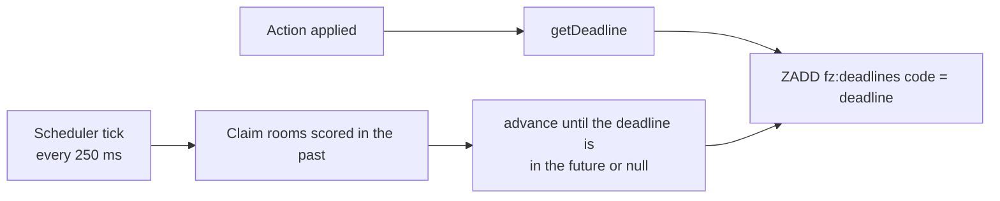
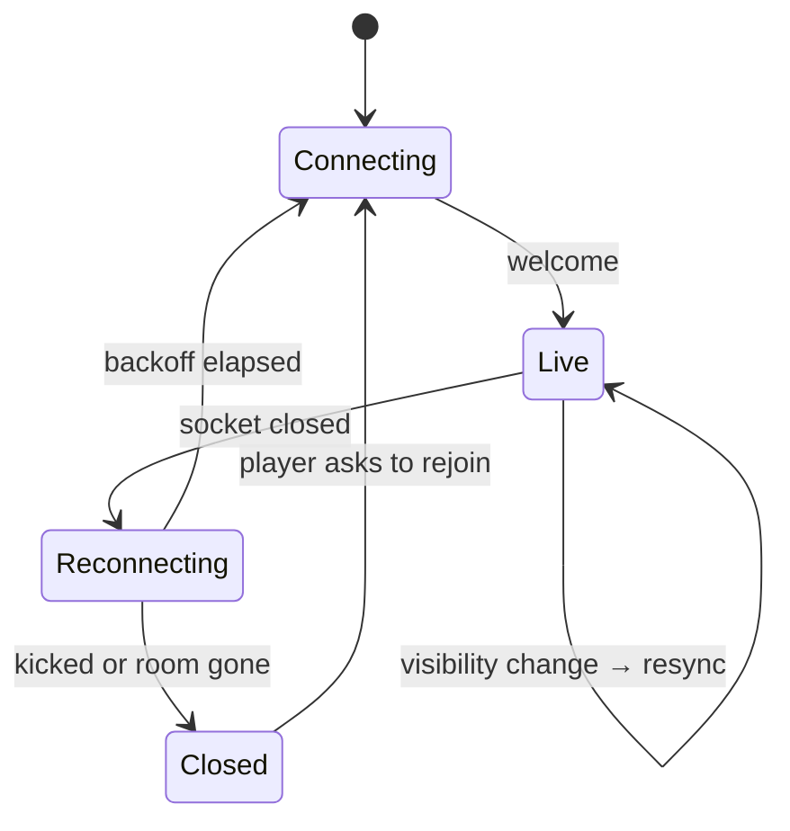

# Real-time behaviour

## Timers

No round anywhere in FriendZone ends because a `setTimeout` fired.

Every game state carries two absolute timestamps — when the current phase began
and when it ends — and exposes a single scheduling question: *when do you next
need attention?* That answer goes into one Redis sorted set keyed by room code.



This survives things a timer does not:

- **A server restart.** Pending transitions are rows in a sorted set, not
  handles in a dead process. Another instance claims the room on its next tick.
- **A backgrounded tab.** Browsers throttle timers in background tabs. It does
  not matter: the browser is not deciding anything.
- **A wrong client clock.** Countdowns are drawn from `deadline − serverNow()`,
  where `serverNow()` is the device clock plus a continuously measured offset.
  Changing the system clock changes nothing anyone else sees.
- **A late tick.** Transitions are computed from stored timestamps, so a tick
  that arrives 400 ms late produces exactly the state a punctual one would,
  just later.

### Claiming is leased, not destructive

Several instances tick at once, so claiming has to hand each due room to
exactly one of them. The Lua script does not remove the entry — it pushes its
score forward by a five-second lease:

```lua
local due = redis.call('ZRANGEBYSCORE', KEYS[1], '-inf', ARGV[1], 'LIMIT', 0, ARGV[3])
for i = 1, #due do
  redis.call('ZADD', KEYS[1], ARGV[2], due[i])   -- now + lease
end
return due
```

If the claiming instance dies mid-transition, the lease expires and another
picks the room up. A round can be a few seconds late; it cannot be advanced
twice or dropped. The successful write overwrites the lease with the real next
deadline.

### One primitive, used for everything

Because the deadline is the only scheduling mechanism, several features fall
out of it for free:

- A transition can set its own deadline to *now* to chain into the next phase.
  The settle loop keeps advancing while the deadline is in the past, so
  "question ends → reveal → next countdown" is one write.
- When every player has answered, the game pulls the round's deadline back to
  now. Nobody watches a clock run down for no reason.
- A disconnected player's grace expiry is just another deadline, scheduled the
  same way and noticed by the same loop.
- "Host skips the results screen" is implemented as *settle this room as though
  the current phase's clock had run out* — no game-specific hook at all.

## Clock synchronisation

The client measures its offset from the server continuously:

```ts
sample(sentAt, serverTime, receivedAt) {
  const roundTrip = receivedAt - sentAt
  if (roundTrip <= this.bestRoundTrip) {
    this.bestRoundTrip = roundTrip
    this.offsetMs = serverTime + roundTrip / 2 - receivedAt
  }
}
```

The lowest-latency sample wins, because on a roughly symmetric path it carries
the least one-way error. A ping every five seconds keeps it current, and the
first estimate is seeded from an HTTP response before any socket exists, so the
first countdown a player sees is already correct.

Countdowns recompute from the absolute deadline on every tick rather than
decrementing a local number, so a dropped frame or a throttled tab cannot make
a timer drift.

## What the public view publishes as its deadline

Not the scheduler's next wake-up — the end of the phase the player is living
through.

This distinction was found by a test. During a Blur Battle round the scheduler
wakes at every reveal step, a few seconds apart, so publishing `getDeadline()`
meant two clients one step apart disagreed about when the round ended, and
every timer jumped backwards each time the image sharpened. The view now reads
the game's `phaseEndsAt`, and the scheduling deadline stays internal.

## Fan-out

```mermaid
sequenceDiagram
  participant P1 as Player on A
  participant A as Instance A
  participant R as Redis
  participant B as Instance B
  participant P2 as Player on B

  P1->>A: action
  A->>A: apply, write, build a view per local socket
  A->>P1: state
  A->>R: PUBLISH fz:room:AB7KQ { origin, version, room, events }
  R->>B: message (B subscribed because it holds a socket here)
  B->>B: ignore if origin is itself; else build views
  B->>P2: state
```

An instance subscribes to a room's channel when its first socket for that room
arrives and unsubscribes when the last one leaves. A room's traffic therefore
reaches the one or two servers with players in it rather than all of them —
fan-out scales with players, not with players × instances.

Payloads are built per viewer, which is a real cost: one `getPublicState` call
and one `JSON.stringify` per connected player per update. It buys the security
property the whole design rests on — another player's secret is not in the
bytes, rather than present and ignored. At the measured scale it is not the
bottleneck; see [performance.md](performance.md).

## Reconnection



The client reconnects with exponential backoff plus jitter, and asks for a full
snapshot every time. There is no delta stream, so there is nothing to get out
of step.

Waking is handled explicitly. A phone that was locked comes back with a socket
the browser still calls open and the server stopped hearing from minutes ago,
so `visibilitychange` triggers either a reconnect or a `resync` rather than
waiting for a heartbeat to time out.

Actions carry a client-generated id, kept for retry. If the socket dies between
tapping an answer and the server hearing about it, the same id goes out on the
new connection and the server recognises it. See
[reliability.md](reliability.md).

## Dead socket detection

The server pings every 15 seconds and terminates a connection that has missed
two in a row. Without this, a socket on a dropped mobile tunnel stays "open" in
the server's opinion until TCP eventually gives up, which can be minutes — long
enough for a player to be shown as present while the rest of the room waits out
a full timer for them.
