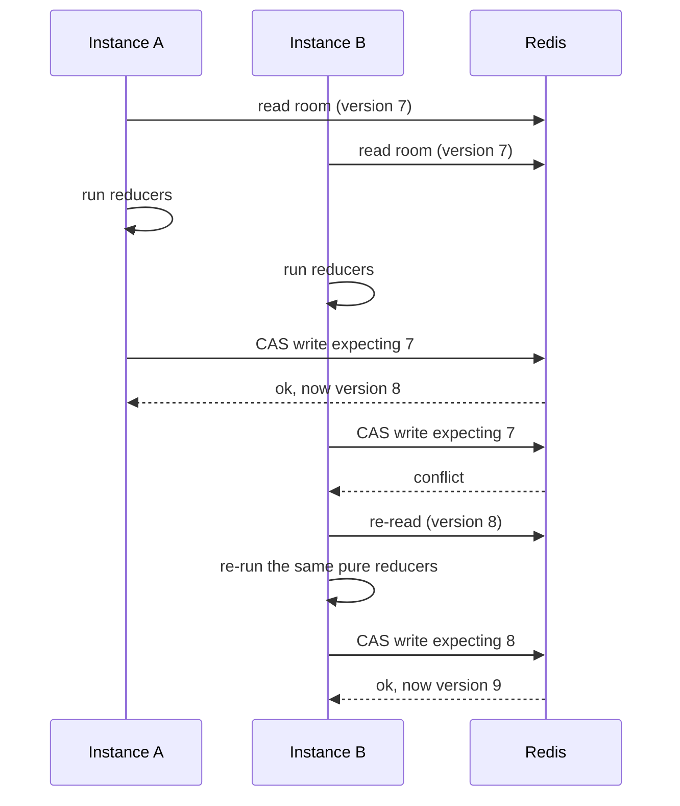

# Redis

## What it holds

| Key | Type | Contents | Lifetime |
| --- | --- | --- | --- |
| `fz:room:{CODE}` | hash | `version`, `state` — the authoritative room | TTL, refreshed on every write |
| `fz:deadlines` | zset | room code → next attention time | entry removed when nothing is pending |
| `fz:rooms:active` | set | live room codes, for metrics and admin | swept by the worker |
| `fz:chan:room:{CODE}` | pub/sub | state updates between instances | transient |
| `fz:rl:{bucket}:{subject}` | hash | token bucket | TTL long enough to refill from empty |
| `fz:bull:*` | BullMQ | background job queues | managed by BullMQ |

Redis is the source of truth for anything happening *now*. It is not being used
as a substitute for Postgres: nothing durable lives only here, and losing the
whole keyspace costs the parties currently in progress and nothing else.

## Three Lua scripts

Each runs as a single atomic Redis operation, and together they are why several
instances can share a room with no lock manager between them.

### Compare-and-set a room

Reads the stored version, writes only if it matches, and updates the deadline
index in the same step. Folding the deadline in matters: a room whose state
said "this round ends at T" while the index disagreed would either stall
forever or be advanced twice.

### Claim due rooms

Range by score, then push each claimed code forward by a lease rather than
removing it, so a crash mid-transition does not strand a round. See
[realtime.md](realtime.md).

### Take a token and read the room

The hot path. One round trip instead of two, and the pair is atomic — a request
can no longer pass the limiter and then read a room that vanished in between.
A throttled client skips the read entirely, so abuse costs strictly less than
legitimate use. Added after profiling; see [performance.md](performance.md).

## Concurrency without locks

Preferred to a distributed lock for three reasons: there is no lease to expire,
so an instance dying mid-mutation strands nothing; there is no lock to forget
to release; and under the load that actually occurs — one room, a few people
tapping at once — conflicts are rare and a retry costs microseconds of pure
function rather than a network round trip spent waiting.

**Measured.** Conflicts track how many people touch one room *at the same
instant*, and nothing else:

| Run | Conflicts |
| --- | --- |
| 20 rooms, 5 players each | 192 |
| 20 rooms, 5 players, 15x the actions | 193 |
| 20 rooms, **1 player each** | 0 |
| 100 rooms, 5 players each | 998 |

About ten per room regardless of how much play happens in it, and none at all
when a room has a single player. They come from the two moments several players
write to one room together: everyone opening the shared link at once, and
everyone's socket closing at once. Ordinary play produces essentially none,
because a room's actions are naturally serialised by its own players taking
turns to tap things.

That is the case optimistic concurrency is good at — rare, short, and resolved
by re-running a pure function.

The `friendzone_cas_retries_total` metric exists so this stays visible. A
sustained rise would mean rooms had become contended and would be the signal to
reconsider.

## When Redis fails

Redis is the one hard dependency, and the failure behaviour is deliberate
rather than incidental.

| Feature | Behaviour without Redis |
| --- | --- |
| Playing a game | **Stops.** Reads and writes fail; actions return `SERVICE_UNAVAILABLE`. No score is corrupted — a write either lands atomically or does not happen. |
| Existing sockets | Stay open. The client shows its reconnect banner and resumes when Redis returns. |
| Round transitions | Pause. Deadlines are still in the sorted set; the scheduler logs and retries, and every overdue room is advanced once it is back. |
| Cross-instance updates | Stop. Players on the same instance still see each other. |
| Rate limiting | **Fails open.** A cache outage must not become a full outage, and the limiter guards against abuse rather than correctness. Visible in the metrics. |
| Health | `/health` stays up (liveness), `/ready` fails (readiness), so the instance leaves the load balancer rotation without being restarted. |

The important property is that nothing silently corrupts. Every state change is
one atomic compare-and-set; there is no read-modify-write window in which a
partial update can survive.

Persistence is configured as append-only with no RDB snapshots. A restart
replays the AOF, so rooms mostly survive; those that do not simply expire and
players are told the room is gone rather than shown a half-restored one.

## Client configuration

Two connections, because a client in subscriber mode cannot issue ordinary
commands. Both retry with backoff rather than throwing, and reconnect on
`READONLY` so a failover that promotes a replica is handled rather than
producing a stream of errors.

Subscriptions are per room and reference-counted against local sockets, so an
instance pays only for rooms it actually holds players for.
