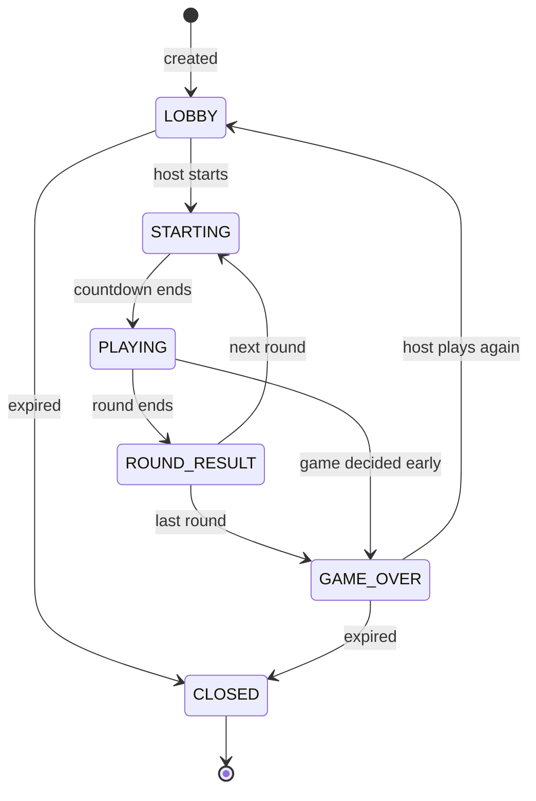
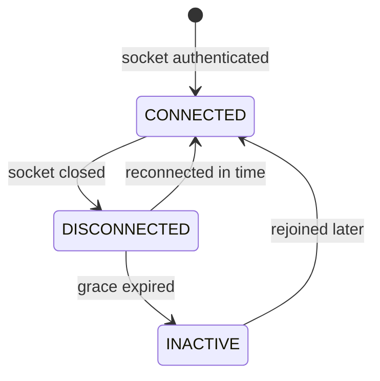
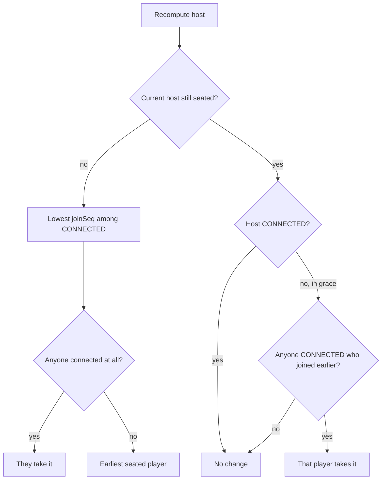
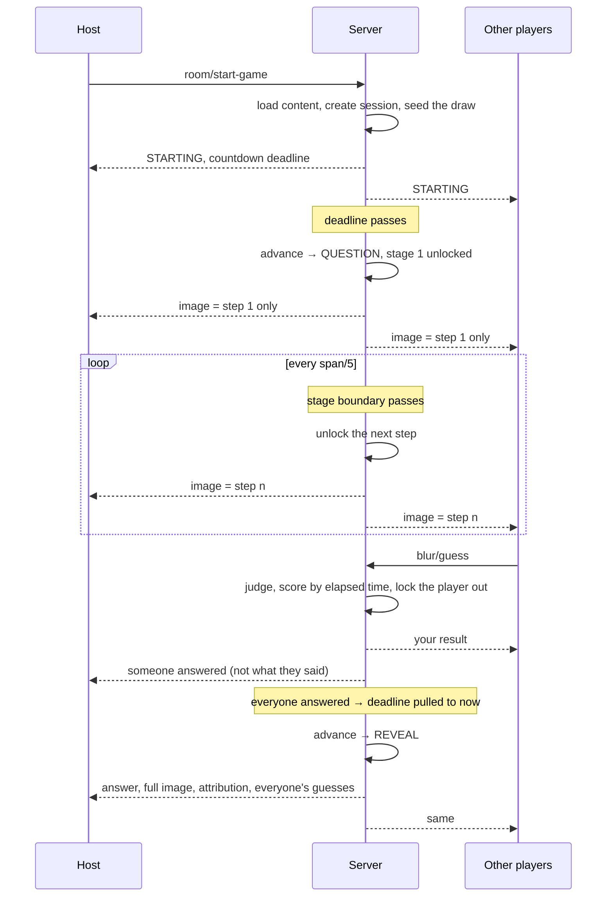
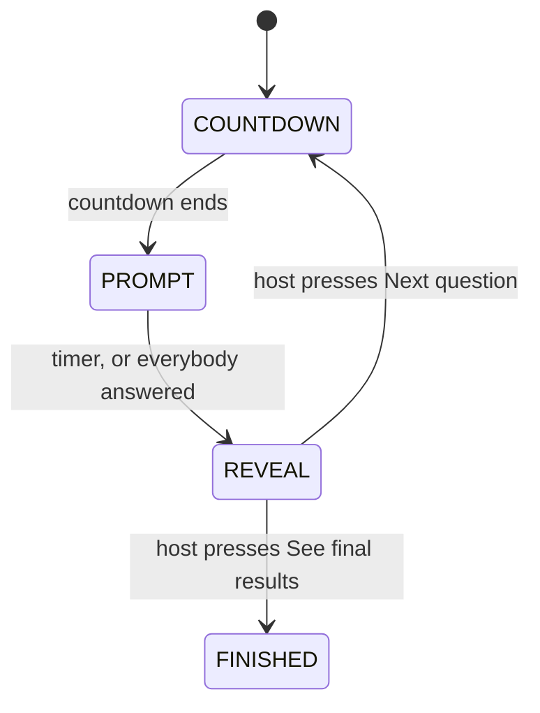
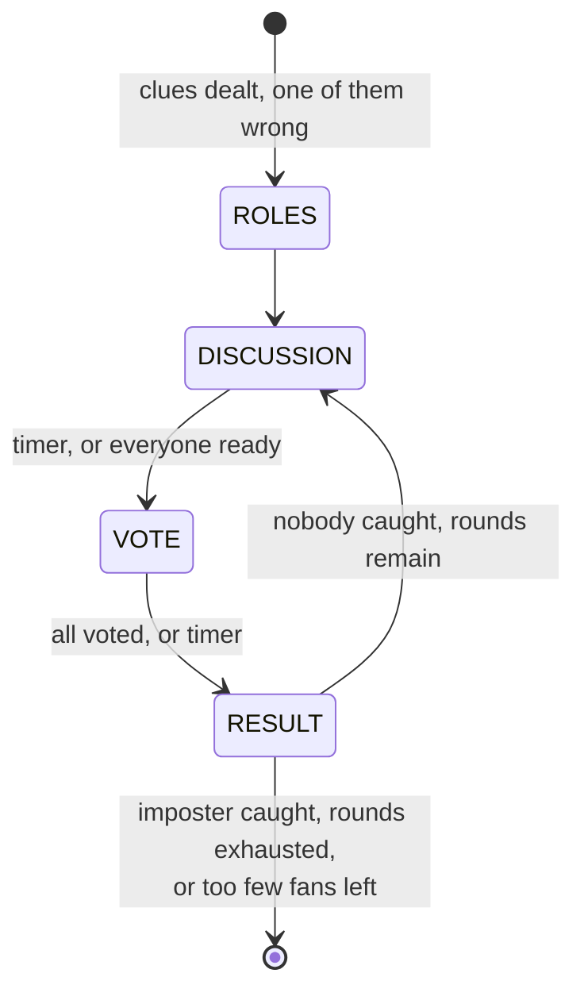

# State machines

## The room

The room service owns these transitions. A game never writes them — it reports
its own phase, and the room maps that onto a status:

| Game phase | Room status |
| --- | --- |
| `COUNTDOWN`, `ASSIGN`, `ROLES` | `STARTING` |
| `REVEAL`, `RESULT` | `ROUND_RESULT` |
| `FINISHED` | `GAME_OVER` |
| anything else | `PLAYING` |

Anything unrecognised counts as active play, which is the safe default: a new
game with an unusual phase name shows players a game screen rather than a
results screen.

`CLOSED` is reached by expiry rather than by a transition anybody performs. A
room's Redis key carries a TTL refreshed on every write — 30 minutes for a
lobby, 15 for a finished game — so a room nobody touched simply stops existing.
The worker later marks the Postgres row closed.

## Presence

A closed socket is not a departure. `DISCONNECTED` starts a 45-second clock
(configurable) during which the seat, the score and any answer already locked
in are all untouched. The expiry is scheduled through the same deadline index
as everything else.

When it fires, the player becomes `INACTIVE` and the game is told via
`onPlayerInactive`, so it can stop waiting on them — which is how a round ends
early when the only player yet to answer has actually left.

Grace is handled **before** the game's own clock in each settle pass. Otherwise
a round would wait out its full timer for somebody the room already knows is
gone.

## Host succession

The rule is *the connected player with the lowest join sequence*, with one
refinement: a host who is merely inside their grace period keeps the room
unless someone who arrived earlier is actually connected. A ten-second phone
tunnel should not hand the party to somebody else.

`joinSeq` is assigned once, never reused, and never changes. That matters
because succession is computed independently by every instance from the same
stored state and must always produce the same answer — there is no election,
no coordinator, and therefore no window in which two instances believe in
different hosts.

The last fallback covers a room everyone briefly dropped out of: rather than
leaving it hostless, the earliest seated player holds it until someone returns.

## A round of Blur Battle

The sharper image files are never sent before their step unlocks. Shipping the
whole ladder and blurring it in CSS would put the answer one devtools panel
away, so each unlock is a server transition and the payload carries exactly one
image URL.

## Mind Meld

Every arrow out of `REVEAL` is a person, not a clock. `getDeadline` returns
`null` there, so the scheduler has nothing to fire and the room publishes
`deadlineAt: null` — no screen shows a countdown, and nothing moves until the
host sends `room/continue`, which the game answers through `hostAdvance`.

This replaced a five-second automatic transition. The five seconds were spent
reading the groups; the argument about who said "pizza" started at about second
four and was cut off every time.

Because it is the same host-only `room/continue` that settles a timed phase
early, nothing else had to learn about it: a non-host is refused with
`NOT_HOST`, and a second press while the next question is already loading is
refused with `INVALID_ACTION` rather than skipping a question.

## Movie Mafia

A tie eliminates nobody. Two exits handle departures honestly: if the imposter
leaves, the fans win immediately rather than the table hunting someone who is
no longer there; if the fans dwindle to one, the imposter wins.
